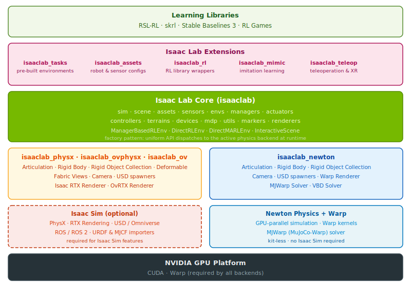
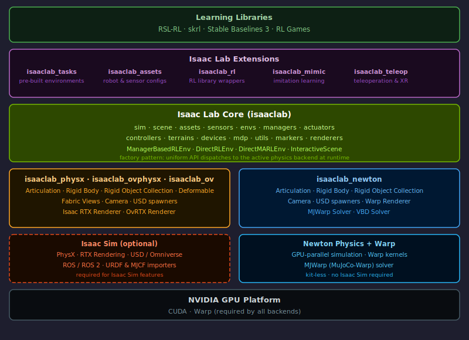

.. _isaac-lab-ecosystem:

Isaac Lab Ecosystem
===================

Isaac Lab is a modular, extensible framework for robot learning built on top of `Isaac Sim`_ and
`Newton`_. It provides a unified interface for the most common workflows in robotics research —
reinforcement learning, learning from demonstrations, and motion planning — while staying easy to
use and easy to extend.

Isaac Lab supports two physics engines through multiple backend packages:

* **PhysX** — the default backend through `Isaac Sim`_, with access to GPU-accelerated
  rigid-body simulation, deformable objects, Fabric views, tiled RTX rendering, ROS/ROS2,
  URDF/MJCF importers, and the full Omniverse toolchain. PhysX can also be used through the
  standalone ``ovphysx`` runtime for kit-less workflows that do not launch Isaac Sim.
* **Newton** — a Warp-native backend that can run in kit-less mode, enabling lightweight
  deployments and GPU-parallel simulation using `Warp`_.

.. note::

   Isaac Lab 3.0 supports a **kit-less installation** mode: you can install Isaac Lab and use the
   Newton physics backend without installing Isaac Sim at all.
   See :ref:`isaaclab-installation-root` for details.

A factory pattern dispatches every asset and sensor instantiation to the correct backend at
runtime, so user code stays unchanged regardless of which backend is active. See
:doc:`/source/overview/core-concepts/multi_backend_architecture` for details.

Package structure
-----------------

Isaac Lab is organized into a set of focused packages that can be used independently or together.

**Core**

* ``isaaclab`` — the core library. Contains simulation context and configuration
  (:mod:`~isaaclab.sim`), the :class:`~isaaclab.scene.InteractiveScene` that aggregates all
  assets, sensors, and terrain for a vectorized set of environments, asset interfaces
  (:mod:`~isaaclab.assets`), sensor interfaces (:mod:`~isaaclab.sensors`), environment base
  classes (:mod:`~isaaclab.envs`), the manager system (:mod:`~isaaclab.managers`),
  composable MDP term functions (:mod:`~isaaclab.envs.mdp`), actuator models
  (:mod:`~isaaclab.actuators`), low-level controllers (:mod:`~isaaclab.controllers`),
  procedural terrain generation (:mod:`~isaaclab.terrains`), and human-input device support
  (:mod:`~isaaclab.devices`).

**Physics and renderer backends**

* ``isaaclab_physx`` — PhysX-backed implementations of articulations,
  rigid bodies, deformable objects, Fabric views, the Isaac RTX renderer, and USD spawners.
  Requires Isaac Sim.
* ``isaaclab_ovphysx`` — standalone PhysX-backed implementations built on ``ovphysx`` and
  TensorBindingsAPI. Requires the ``ovphysx`` package and can run without launching Isaac Sim.
* ``isaaclab_ov`` — Omniverse renderer package that provides the OVRTX renderer for
  RTX-based tiled camera rendering. Requires the ``ovrtx`` package and can be used in
  kit-less workflows without Isaac Sim.
* ``isaaclab_newton`` — Newton-backed implementations of articulations, rigid bodies, and the
  Warp renderer. Supports kit-less installation without Isaac Sim.

**Extensions**

* ``isaaclab_assets`` — pre-configured robot and sensor :class:`~isaaclab.utils.configclass`
  dataclasses for a wide range of robots (Franka, Unitree, ANYmal, Spot, Allegro, humanoids,
  quadcopters, and more) and sensors (Velodyne, GelSight).
* ``isaaclab_tasks`` — registered `gymnasium`_ environments organized into two authoring patterns:

  * *Manager-based* — behavior is fully specified through composable manager configurations
    (observations, rewards, terminations, events, commands, actions). Well-suited for research
    that requires clean separation between task specification and environment logic.
  * *Direct* — a single Python class implements the full step/reset/obs/reward loop, similar
    in style to Isaac Gym. Convenient for rapid prototyping and tasks with complex custom logic.

* ``isaaclab_rl`` — thin wrappers that adapt Isaac Lab environments to the vectorized
  environment interfaces expected by `RSL-RL`_, `skrl`_, `Stable Baselines 3`_, and
  `RL Games`_.
* ``isaaclab_mimic`` — APIs and pre-configured environments for data generation and imitation
  learning, including cuRobo-based motion planners and a full dataset-generation pipeline.
* ``isaaclab_teleop`` — teleoperation session orchestration with XR (OpenXR / CloudXR) support,
  device retargeters for manipulators and humanoids, and gamepad/spacemouse/keyboard input.
* ``isaaclab_visualizers`` — supplementary visualizer backends (Isaac Kit, Rerun, Viser) that
  work with any physics backend.
* ``isaaclab_contrib`` — community-contributed features: multirotor assets, TacSL visuo-tactile
  sensors, drone thrust controllers, and more.
* ``isaaclab_experimental`` — pre-production experiments, including Warp-accelerated manager and
  environment variants.

Where does Isaac Lab fit in the Isaac ecosystem?
------------------------------------------------

Over the years, NVIDIA has developed a number of tools for robotics and AI. These tools leverage
the power of GPUs to accelerate simulation both in terms of speed and realism.

`Isaac Gym`_ :cite:`makoviychuk2021isaac` provided a high-performance GPU-based physics simulation
for robot learning built on top of `PhysX`_. Its end-to-end GPU pipeline enabled frame rates
far beyond what CPU-based physics engines could achieve. The tool proved successful across a
number of research projects, including legged locomotion :cite:`rudin2022learning`
:cite:`rudin2022advanced`, in-hand manipulation :cite:`handa2022dextreme`
:cite:`allshire2022transferring`, and industrial assembly :cite:`narang2022factory`.

`Isaac Sim`_ is a general-purpose robot simulation toolkit built on top of `Omniverse`_. It
integrates the capabilities of Isaac Gym while adding high-fidelity rendering, ROS/ROS2,
deformable-object simulation, synthetic data generation, domain randomization, tiled rendering
for vectorized observations, and cloud support via `Isaac Automator`_. With the Isaac Gym legacy
API absorbed into Isaac Sim, NVIDIA also released open-sourced environment collections
`IsaacGymEnvs`_ and `OmniIsaacGymEnvs`_ to showcase the capabilities of these simulators.
Those environment collections are now deprecated in favor of Isaac Lab.

Isaac Lab supersedes `IsaacGymEnvs`_, `OmniIsaacGymEnvs`_, and `Orbit`_ as the single robot
learning framework for Isaac Sim. It retains full access to the PhysX/Isaac Sim stack while
adding the Newton physics backend for kit-less deployments, an expanded sensor suite, imitation
learning tooling, XR teleoperation, and a rich set of pre-built tasks.

Is Isaac Lab a simulator?
-------------------------

At its core, Isaac Lab is **not** a robotics simulator; it is a framework for building robot
learning applications on top of a simulator. An analogous example is `RoboSuite`_, which is
built on top of `MuJoCo`_ for fixed-base manipulation. Other examples include
`MuJoCo Playground`_ (built on `MJX`_) and Isaac Gym (built on `PhysX`_).

Isaac Lab supports both `PhysX`_ and `Newton`_ as physics backends and is deliberately
agnostic to the underlying engine — user environments and tasks do not import backend-specific
modules directly.

The framework addresses a recurring problem with standalone task implementations: because each
task reimplements the observation, reward, termination, and randomization logic from scratch,
large projects accumulate significant code duplication. Isaac Lab solves this with two
complementary patterns:

* **Manager-based** environments defer every behavioral concern to typed, composable
  *manager* objects (``ObservationManager``, ``RewardManager``, ``TerminationManager``,
  ``EventManager``, ``CurriculumManager``, ``CommandManager``, ``ActionManager``,
  ``RecorderManager``). Each manager is driven by small, reusable MDP term functions that live
  in :mod:`isaaclab.envs.mdp`. This makes it easy to mix and match terms across tasks and to
  test individual components in isolation.

* **Direct** environments implement ``_get_observations``, ``_get_rewards``,
  ``_get_dones``, and ``_reset_idx`` directly in a subclass, similar to the Isaac Gym style.
  They sacrifice some modularity for simplicity and are a natural starting point for rapid
  prototyping.

Both patterns expose a standard `gymnasium`_ ``Env`` interface with vectorized semantics,
so the same environment works unmodified with any of the supported RL libraries.
Configuration management uses `Hydra`_ with a preset system that allows selecting physics
backends and hyperparameter sweeps from the command line.

Why should I use Isaac Lab?
---------------------------

Isaac Lab provides an open-sourced platform for the community to build benchmarks and robot
learning systems together. Sharing a common infrastructure lets teams reuse existing components,
compare results on the same tasks, and focus on the research problems that matter rather than
rebuilding simulation scaffolding from scratch.

Concretely, Isaac Lab offers:

* **Two authoring patterns** — manager-based for modular research and direct for rapid
  prototyping — with a shared :class:`~isaaclab.scene.InteractiveScene` and sensor stack.
* **Multi-backend simulation** — switch between PhysX and Newton from the command line; the
  same environment code runs on both.
* **Rich sensor suite** — cameras (tiled and standard), ray-casters, contact sensors, IMU,
  frame transformers, joint-wrench sensors, and visuo-tactile sensors.
* **Imitation learning tooling** — ``isaaclab_mimic`` provides cuRobo-based planners and a
  full dataset-generation pipeline for human demonstration collection.
* **Teleoperation and XR** — ``isaaclab_teleop`` supports OpenXR, CloudXR, gamepads,
  spacemouses, and Haply devices with retargeters for manipulators and humanoids.
* **Hydra configuration management** — hierarchical configs with command-line overrides and a
  preset system for multi-backend environment variants.
* **RL library integrations** — wrappers for RSL-RL, skrl, Stable Baselines 3, and RL Games
  ship in ``isaaclab_rl``.
* **Kit-less deployment** — run policies and simulations using the Newton backend without a
  full Isaac Sim installation.

We are working with labs in universities and research institutions to integrate their work into
Isaac Lab and hope that others in the community will join us. If you are interested in
contributing, please reach out to us.

.. _PhysX: https://developer.nvidia.com/physx-sdk
.. _Newton: https://github.com/newton-physics/newton
.. _Warp: https://github.com/NVIDIA/warp
.. _Isaac Sim: https://developer.nvidia.com/isaac-sim
.. _Omniverse: https://www.nvidia.com/en-us/omniverse/
.. _Isaac Gym: https://developer.nvidia.com/isaac-gym
.. _IsaacGymEnvs: https://github.com/isaac-sim/IsaacGymEnvs
.. _OmniIsaacGymEnvs: https://github.com/isaac-sim/OmniIsaacGymEnvs
.. _Orbit: https://isaac-orbit.github.io/
.. _Isaac Automator: https://github.com/isaac-sim/IsaacAutomator
.. _gymnasium: https://gymnasium.farama.org/
.. _Hydra: https://hydra.cc/
.. _RSL-RL: https://github.com/leggedrobotics/rsl_rl
.. _skrl: https://skrl.readthedocs.io/
.. _Stable Baselines 3: https://stable-baselines3.readthedocs.io/
.. _RL Games: https://github.com/Denys88/rl_games
.. _AirSim: https://microsoft.github.io/AirSim/
.. _DoorGym: https://github.com/PSVL/DoorGym/
.. _ManiSkill: https://github.com/haosulab/ManiSkill
.. _ThreeDWorld: https://www.threedworld.org/
.. _RoboSuite: https://github.com/ARISE-Initiative/robosuite
.. _MuJoCo: https://mujoco.org/
.. _MuJoCo Playground: https://playground.mujoco.org/
.. _MJX: https://mujoco.readthedocs.io/en/stable/mjx.html
.. _Bullet: https://github.com/bulletphysics/bullet3
.. _Flex: https://developer.nvidia.com/flex
